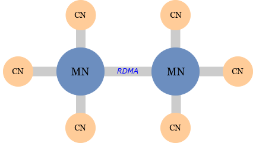

# Ethane: An Asymmetric File System for Disaggregated Persistent Memory


## 1. Overview

This repository contains the source code, setup utilities, and test scripts of *Ethane: An Asymmetric File System for Disaggregated Persistent Memory*.



## 2. Getting Started

### 2.1 Prerequisites

**Hardware:** Intel Optane DC Persistent Memory, Mellanox ConnectX-6 RNIC

**OS:** Ubuntu 18.04+, Linux Kernel 4.15+

**Libraries:** libzookeeper_mt, libjemalloc, Mellanox OFED5.0+

### 2.2 Configure and Build

1. Clone Ethane at `/home/DPMFS`
2. Build Ethane

```bash
cd /home/DPMFS
mkdir cmake-build-debug && cd cmake-build-debug
make -j
```

3. Configure Ethane
   1. Network configuration: 
      + `scripts/conf/all_nodes.txt`: hostnames of all nodes involved (including CNs and MNs)
      + `scripts/conf/compute_nodes.txt`: hostnames of all CNs
      + `scripts/conf/memory_nodes.txt`: hostnames of all MNs
   2. File system configuration `scripts/conf/fs.yaml`
      + **namespace_kv_size_mb:** total size of namespace entries in data-plane FS
      + **block_mapping_kv_size_mb:** total size of block mapping entries in data-plane FS
      + **arena_nr_logs:** number of mlog slots in an arena
      + **max_nr_logs:** max number of logs
   3. Memory node configuration `scripts/conf/memd.yaml`
      + **pmem_pool_file:** pmem DAX device file path (e.g., `/dev/dax0.0`)
      + **pmem_pool_size_mb:** pmem pool size
      + **cmem_pool_size_kb:** RNIC on-device memory size (used for locks)
   4. Compute node configuration
      1. client configuration `scripts/conf/cli.yaml`
         + **namespace_cache_size_max_mb:** size of namespace cache
         + **block_mapping_cache_size_max_mb:** size of block cache
         + **local_log_region_size_mb:** client-local log region size
      2. Log checkpointer configuration `scripts/conf/logd_cli.yaml`
         + **nr_max_outstanding_updates:** max number of outstanding updates in sharedFS

### 2.3 Run the Toy Example

We provide a simple benchmark program `examples/bench.c` where each client creates a private directory at FS root, and repeatedly creates child directories inside it. The program will output each client's throughput. You can run the program as follows:

+ Run `scripts/bg.sh` on any host. The script will `ssh` into configured compute and memory nodes and setup the environment:
  + disable hyperthreading and turbo boost, and increase CPU frequency
  + disable DDIO
  + start background threads like memory daemons and log checkpoint daemons.
+ Run `scripts/bench.sh` on any host. The script will `ssh` into compute nodes, and run the simple benchmark.

## 3. Using Ethane

Ethane provides POSIX-like APIs defined at `ethanefs.h`.

```C
ethanefs_t *ethanefs_init(zhandle_t *zh, int prom_daemon_port);
ethanefs_cli_t *ethanefs_cli_init(ethanefs_t *fs, struct ethane_cli_config *config);

int ethanefs_getattr(ethanefs_cli_t *cli, const char *path, struct stat *stbuf);
int ethanefs_mkdir(ethanefs_cli_t *cli, const char *path, mode_t mode);
int ethanefs_rmdir(ethanefs_cli_t *cli, const char *path);
int ethanefs_unlink(ethanefs_cli_t *cli, const char *path);
ethanefs_open_file_t *ethanefs_create(ethanefs_cli_t *cli, const char *path, mode_t mode);
ethanefs_open_file_t *ethanefs_open(ethanefs_cli_t *cli, const char *path);
int ethanefs_close(ethanefs_cli_t *cli, ethanefs_open_file_t *file);
long ethanefs_read(ethanefs_cli_t *cli, ethanefs_open_file_t *file, char *buf, size_t size, off_t off);
long ethanefs_write(ethanefs_cli_t *cli, ethanefs_open_file_t *file, const char *buf, size_t size, off_t off);
int ethanefs_truncate(ethanefs_cli_t *cli, ethanefs_open_file_t *file, off_t size);
int ethanefs_chmod(ethanefs_cli_t *cli, const char *path, mode_t mode);
int ethanefs_chown(ethanefs_cli_t *cli, const char *path, uid_t uid, gid_t gid);
```

You can write client programs as follows. The program should be linked with `cmake-build-debug/libethane.so`. Before running the client, `scripts/bg.sh` should be launched to setup the environment and run background threads.

```c
struct ethane_cli_config config = { }; /* client config */
zhandle_t *zh;
ethanefs_t *fs;
ethanefs_cli_t *cli;

zh = zookeeper_init(zookeeper_ip, NULL, 100000, NULL, NULL, 0);
fs = ethanefs_init(zh, 8080);
cli = ethanefs_cli_init(fs, &config);

ethanefs_mkdir(cli, "/hello-world", mode);
```

If you have any questions about Ethane, please contact Miao Cai (miaocai@nuaa.edu.cn).
